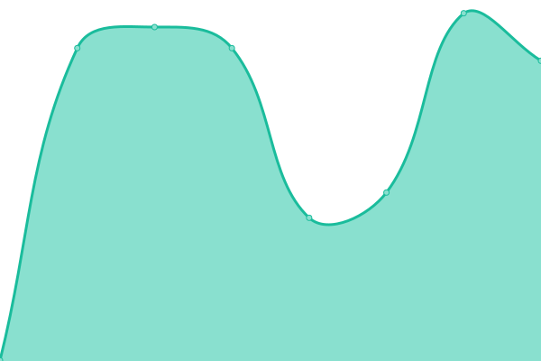

# [📈 Live Status](https://mburrieza.github.io/StatusPage): <!--live status--> **🟩 All systems operational**

This repository contains the open-source uptime monitor and status page for [mburrieza](https://mburrieza.github.io/StatusPage), powered by [Upptime](https://github.com/upptime/upptime).

With [Upptime](https://upptime.js.org), you can get your own unlimited and free uptime monitor and status page, powered entirely by a GitHub repository. We use [Issues](https://github.com/mburrieza/StatusPage/issues) as incident reports, [Actions](https://github.com/mburrieza/StatusPage/actions) as uptime monitors, and [Pages](https://mburrieza.github.io/StatusPage) for the status page.

<!--start: status pages-->
<!-- This summary is generated by Upptime (https://github.com/upptime/upptime) -->
<!-- Do not edit this manually, your changes will be overwritten -->
<!-- prettier-ignore -->
| URL | Status | History | Response Time | Uptime |
| --- | ------ | ------- | ------------- | ------ |
|  [ExtendIP Portal](https://extendip.centurylink.com) | 🟩 Up | [extend-ip-portal.yml](https://github.com/mburrieza/StatusPage/commits/HEAD/history/extend-ip-portal.yml) | 

 726ms
     
 | 

<a href="https://mburrieza.github.io/StatusPage/history/extend-ip-portal">100.00%</a>
    

|  [Speedtest Satellite Services](http://speedtest.extendvno.centurylink.com) | 🟩 Up | [speedtest-satellite-services.yml](https://github.com/mburrieza/StatusPage/commits/HEAD/history/speedtest-satellite-services.yml) | 

 372ms
     
 | 

<a href="https://mburrieza.github.io/StatusPage/history/speedtest-satellite-services">93.09%</a>
    

|  [Meraki Dashboard](https://dashboard.meraki.com) | 🟩 Up | [meraki-dashboard.yml](https://github.com/mburrieza/StatusPage/commits/HEAD/history/meraki-dashboard.yml) | 

 428ms
     
 | 

<a href="https://mburrieza.github.io/StatusPage/history/meraki-dashboard">100.00%</a>
    

|  [Meraki API Portal](https://api.meraki.com/api/v1/organizations) | 🟩 Up | [meraki-api-portal.yml](https://github.com/mburrieza/StatusPage/commits/HEAD/history/meraki-api-portal.yml) | 

 1947ms
     
 | 

<a href="https://mburrieza.github.io/StatusPage/history/meraki-api-portal">100.00%</a>
    

|  [FortiCloud](https://login.forticloud.com) | 🟩 Up | [forti-cloud.yml](https://github.com/mburrieza/StatusPage/commits/HEAD/history/forti-cloud.yml) | 

 454ms
     
 | 

<a href="https://mburrieza.github.io/StatusPage/history/forti-cloud">98.69%</a>
    

<!--end: status pages-->

[**Visit our status website →**](https://mburrieza.github.io/StatusPage)

## 📄 License

- Powered by: [Upptime](https://github.com/upptime/upptime)
- Code: [MIT](./LICENSE) © [mburrieza](https://mburrieza.github.io/StatusPage)
- Data in the `./history` directory: [Open Database License](https://opendatacommons.org/licenses/odbl/1-0/)
